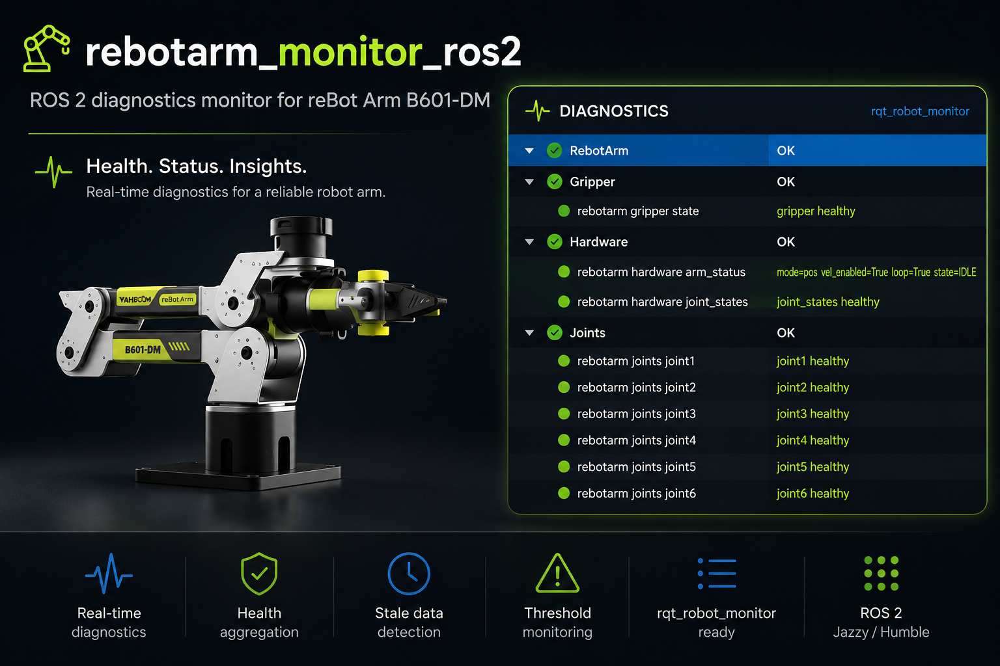

# rebotarm_monitor_ros2

> ROS 2 health monitoring for **reBot Arm B601-DM** — read-only `diagnostic_msgs`
> alongside the
> [Seeed reBot Arm driver](https://github.com/Seeed-Projects/reBotArmController_ROS2).

[](https://github.com/danieldoradotalaveron-rb/rebotarm_monitor_ros2/actions/workflows/ci.yml)
[](https://docs.ros.org/en/jazzy/)
[](https://www.python.org/)
[](https://opensource.org/licenses/Apache-2.0)
[](https://github.com/Seeed-Projects/reBotArmController_ROS2)

<p align="center">
  
</p>

`rebotarm_monitor` subscribes to driver topics, checks host link and process
health, and publishes `/diagnostics` (with `diagnostic_aggregator` for
`rqt_robot_monitor`).

## Quick start

Prerequisites: [Seeed driver](https://github.com/Seeed-Projects/reBotArmController_ROS2)
built and `reBotArmController` running.

```bash
source /opt/ros/jazzy/setup.bash
source /path/to/driver-workspace/install/setup.bash
cd /path/to/rebotarm_monitor_ros2
colcon build --packages-select rebotarm_monitor && source install/setup.bash
ros2 launch rebotarm_monitor monitor.launch.py
# optional: ros2 run rqt_robot_monitor rqt_robot_monitor
```

## Contents

- [Quick start](#quick-start)
- [Requirements](#requirements)
- [Build](#build)
- [Run](#run)
- [What it reports](#what-it-reports)
- [Configuration](#configuration)
- [Architecture](#architecture)
- [Testing](#testing)
- [Repository layout](#repository-layout)
- [License](#license)

## Requirements

- ROS 2 [Jazzy](https://docs.ros.org/en/jazzy/) on Ubuntu 24.04 (same as CI).
- A sourced workspace that provides `rebotarm_msgs` from the
  [Seeed reBot Arm driver](https://github.com/Seeed-Projects/reBotArmController_ROS2).
- A running `reBotArmController` node.
- `python3-psutil` (declared as an `exec_depend`; install with `rosdep` or
  `apt install python3-psutil`).

## Build

```bash
source /opt/ros/jazzy/setup.bash
source /path/to/driver-workspace/install/setup.bash   # provides rebotarm_msgs
cd /path/to/rebotarm_monitor_ros2
colcon build --packages-select rebotarm_monitor
source install/setup.bash
```

## Run

```bash
ros2 launch rebotarm_monitor monitor.launch.py
ros2 run rqt_robot_monitor rqt_robot_monitor   # optional GUI
```

The launch file starts the monitor node plus a `diagnostic_aggregator` so the
output is ready to be visualized in `rqt_robot_monitor`.

### Aggregator groups in rqt

The launch loads one of two aggregator configs based on `enable_can_monitor`:

| `enable_can_monitor` | rqt tree (`RebotArm/…`) |
|----------------------|------------------------|
| `false` (default — USB/serial) | Control, Gripper, Hardware, Joints, Link, System |
| `true` (SocketCAN) | Control, Gripper, Hardware, Joints, Link, System, Bus |

Expand **System** to see the active payload profile:

- `rebotarm/system/monitor_config` — message like
  `payload profile: light (0.5 kg assumed payload)` (always published).
- `rebotarm/system/driver` — driver process health.

One profile is active per monitor process (`payload_profile` launch argument,
default `light`). Changing profile requires restarting the monitor node.

### Driver channel and link monitoring

The Seeed driver connects over a character device (`channel` launch
argument). The default in their `arm.yaml` is `/dev/ttyACM0` (USB serial).
Some setups use a udev symlink (for example `/dev/ttyRebotB601`) or SocketCAN
(`channel:=can0`) instead.

The monitor does not read the driver's `channel` parameter. Configure the link
layer explicitly so it matches how you launch the driver:

| Driver transport | Driver launch | Monitor launch |
|------------------|---------------|----------------|
| USB serial (default) | `channel:=/dev/ttyACM0` | default (no extra args) |
| USB serial + udev symlink | `channel:=/dev/ttyRebotB601` | `serial_device:=/dev/ttyRebotB601` |
| SocketCAN | `channel:=can0` | `enable_serial_monitor:=false enable_can_monitor:=true` |

Example with a custom symlink:

```bash
# Terminal 1 — driver
ros2 launch rebotarm_bringup driver_only.launch.py channel:=/dev/ttyRebotB601

# Terminal 2 — monitor (same device path)
ros2 launch rebotarm_monitor monitor.launch.py serial_device:=/dev/ttyRebotB601
```

## What it reports

Each `DiagnosticStatus` in `/diagnostics` corresponds to one tracker. Trackers
can be disabled individually via ROS parameters or launch arguments.

| Diagnostic name | Source | Default |
|-----------------|--------|---------|
| `rebotarm/hardware/joint_states` | `/rebotarm/joint_states` | on |
| `rebotarm/control/arm_status` | `/rebotarm/arm_status` (latched) | on |
| `rebotarm/control/gravity_compensation` | `/rebotarm/arm_status` (latched) | on (with arm status monitor) |
| `rebotarm/joints/jointN` (N=1..6) | `/rebotarm/joints/jointN/state` | on |
| `rebotarm/gripper/state` | `/rebotarm/gripper/state` | on |
| `rebotarm/link/serial` | host device node | on (default `/dev/ttyACM0`, Seeed standard) |
| `rebotarm/bus/<iface>` | `/sys/class/net/<iface>` counters | off (only with `enable_can_monitor:=true`) |
| `rebotarm/system/monitor_config` | node parameters | on (shows active `payload_profile`) |
| `rebotarm/system/driver` | `psutil` lookup of the driver process | on |

Topics published:

| Topic | Type |
|-------|------|
| `/diagnostics` | `diagnostic_msgs/DiagnosticArray` |
| `/diagnostics_agg` | `diagnostic_msgs/DiagnosticArray` (from aggregator) |
| `/diagnostics_toplevel_state` | `diagnostic_msgs/DiagnosticStatus` (from aggregator) |

## Configuration

Launch arguments below cover common overrides. The full parameter table and
diagnostic reference are in
[`src/rebotarm_monitor/README.md`](src/rebotarm_monitor/README.md).
Threshold derivation and semantics for the B601 per-joint maps are in
[`docs/per-joint-thresholds.md`](docs/per-joint-thresholds.md).

Scalar ROS parameters resolve in this order (lowest → highest precedence):

1. Defaults in `rebotarm_monitor/parameters.py` (`_PARAM_SPECS`).
2. `config/monitor.yaml`.
3. The inline parameter dict in `monitor.launch.py`.
4. CLI overrides on `ros2 launch ... key:=value`.

B601 per-joint threshold maps are injected by `load_params()` from the
resolved `payload_profile`. They are not ROS parameters and cannot be set
from YAML or the launch file.

The most-used parameters are exposed as launch arguments:

| Argument | Default |
|----------|---------|
| `joint_states_topic` | `/rebotarm/joint_states` |
| `expected_rate_hz` | `100.0` |
| `stale_timeout_s` | `0.5` |
| `min_rate_ratio` | `0.5` |
| `max_position_jump_rad` | `0.5` |
| `max_abs_velocity_rad_s` | `10.0` |
| `max_abs_effort_nm` | `8.0` |
| `status_log_period_s` | `1.0` |
| `diagnostics_period_s` | `0.0` (means same as `status_log_period_s`) |
| `enable_serial_monitor` | `true` |
| `serial_device` | `/dev/ttyACM0` (same path as driver `channel:=`) |
| `enable_can_monitor` | `false` (set `true` for SocketCAN) |
| `can_interfaces` | `can0` (comma-separated list, e.g. `can0,can1`) |
| `enable_process_monitor` | `true` |
| `driver_process_pattern` | `reBotArmController` |
| `driver_process_pid` | `0` (auto-discover by pattern) |
| `use_diagnostic_aggregator` | `true` |
| `payload_profile` | `light` (0.5 kg assumed payload). Also: `medium` (1.0 kg), `rated` (1.5 kg) |

Example overrides:

```bash
ros2 launch rebotarm_monitor monitor.launch.py \
  expected_rate_hz:=50.0 \
  max_abs_effort_nm:=12.0

# Pick payload profile (light / medium / rated)
ros2 launch rebotarm_monitor monitor.launch.py payload_profile:=rated

# SocketCAN setup
ros2 launch rebotarm_monitor monitor.launch.py \
  enable_serial_monitor:=false \
  enable_can_monitor:=true \
  can_interfaces:=can0

# USB serial with udev symlink (must match driver channel:=)
ros2 launch rebotarm_monitor monitor.launch.py \
  serial_device:=/dev/ttyRebotB601
```

Scalar parameters such as rates, stale timeouts, and the serial device path
can be tuned in `config/monitor.yaml`. B601 per-joint threshold maps are
defined in `parameters.py` and selected by `payload_profile`; see
[`docs/per-joint-thresholds.md`](docs/per-joint-thresholds.md) for values
and derivation.

## Architecture

The package follows a small hexagonal layout. Trackers are the strategies,
the orchestrator is the application service, and adapters isolate the only
parts that touch the outside world (filesystem, `psutil`):

```
rebotarm_monitor/
├── node.py             # ROS 2 adapter: params, publisher, timers
├── orchestrator.py     # registers trackers + builds DiagnosticArray
├── factories.py        # composition root: params dict → trackers
├── parameters.py       # declare + load ROS parameters
├── domain/             # HealthTracker contract + TrackerContext
├── trackers/           # one file per concern (joint_states, per_joint,
│                       # arm_status, gravity_compensation, gripper,
│                       # serial_link, can_bus, process, monitor_config)
├── adapters/           # SysFsReader, ProcessInspector, DevicePathInspector
└── support/            # diagnostics helpers, rate window
```

To add a tracker, implement `HealthTracker` in `trackers/` and register it
in `factories.build_trackers`.

## Testing

Unit tests live next to the package and use the in-memory adapter fakes
(`FakeSysFsReader`, `FakeProcessInspector`, `FakeDevicePathInspector`) so no
real CAN interface, TTY device, or driver process is needed.

```bash
colcon test --packages-select rebotarm_monitor
colcon test-result --verbose
```

Or run pytest directly inside the package once the workspace is sourced:

```bash
cd src/rebotarm_monitor
pytest
```

## Repository layout

```
rebotarm_monitor_ros2/
├── docs/
│   ├── hero.png
│   └── per-joint-thresholds.md
└── src/
    └── rebotarm_monitor/        # ament_python package
        ├── config/
        ├── launch/
        ├── rebotarm_monitor/    # source
        └── test/                # unit tests
```

See [`src/rebotarm_monitor/README.md`](src/rebotarm_monitor/README.md) for the
package-level reference (diagnostic names, full parameter list, examples).

## License

Released under the [Apache License 2.0](https://www.apache.org/licenses/LICENSE-2.0).
