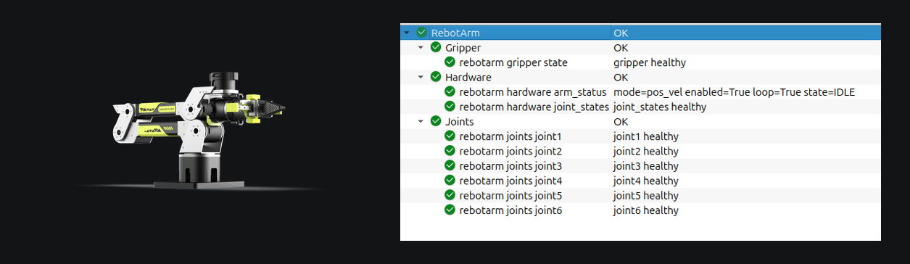

# rebotarm_monitor_ros2

[](https://docs.ros.org/)
[](https://www.python.org/)
[](https://opensource.org/licenses/Apache-2.0)
[](https://colcon.readthedocs.io/)

ROS 2 workspace with a single package, `rebotarm_monitor`, that subscribes to
the topics published by a running reBot Arm B601-DM driver and publishes
`diagnostic_msgs/DiagnosticArray` on `/diagnostics`.

<p align="center">
  
</p>
<p align="center">
  <sub><strong>Left:</strong> reBot Arm B601-DM &nbsp;·&nbsp; <strong>Right:</strong> aggregated diagnostics in <code>rqt_robot_monitor</code></sub>
</p>

## Contents

- [Requirements](#requirements)
- [Build](#build)
- [Run](#run)
- [Topics](#topics)
- [Configuration](#configuration)
- [Repository layout](#repository-layout)
- [License](#license)

## Requirements

- ROS 2 Jazzy (also tested on Humble).
- A sourced ROS 2 workspace that provides `rebotarm_msgs` (built from the
  Seeed reBot Arm driver workspace with `colcon`).
- A running `reBotArmController` node.

## Build

```bash
source /opt/ros/jazzy/setup.bash
source /path/to/driver-workspace/install/setup.bash   # provides rebotarm_msgs
cd /path/to/rebotarm_monitor_ros2
colcon build --packages-select rebotarm_monitor
source install/setup.bash
```

## Run

```bash
ros2 launch rebotarm_monitor monitor.launch.py
ros2 run rqt_robot_monitor rqt_robot_monitor   # optional GUI
```

## Topics

| Direction | Topic | Type |
|-----------|-------|------|
| sub | `/rebotarm/joint_states` | `sensor_msgs/JointState` |
| sub | `/rebotarm/joints/jointN/state` (N = 1..6) | `rebotarm_msgs/JointMotorState` |
| sub | `/rebotarm/arm_status` (latched) | `rebotarm_msgs/ArmStatus` |
| sub | `/rebotarm/gripper/state` | `rebotarm_msgs/JointMotorState` |
| pub | `/diagnostics` | `diagnostic_msgs/DiagnosticArray` |
| pub | `/diagnostics_agg` | `diagnostic_msgs/DiagnosticArray` |
| pub | `/diagnostics_toplevel_state` | `diagnostic_msgs/DiagnosticStatus` |

## Configuration

Defaults live in `src/rebotarm_monitor/config/joint_state_monitor.yaml` and
`src/rebotarm_monitor/config/diagnostic_aggregator.yaml`. The most common
settings are also exposed as launch arguments:

| Argument | Default |
|----------|---------|
| `joint_states_topic` | `/rebotarm/joint_states` |
| `expected_rate_hz` | `100.0` |
| `stale_timeout_s` | `0.5` |
| `min_rate_ratio` | `0.5` |
| `max_position_jump_rad` | `0.5` |
| `max_abs_velocity_rad_s` | `10.0` |
| `max_abs_effort_nm` | `8.0` |
| `status_log_period_s` | `1.0` |
| `diagnostics_period_s` | `0.0` (same as `status_log_period_s`) |
| `use_diagnostic_aggregator` | `true` |

Example:

```bash
ros2 launch rebotarm_monitor monitor.launch.py \
  expected_rate_hz:=50.0 \
  max_abs_effort_nm:=12.0
```

## Repository layout

```
rebotarm_monitor_ros2/
├── docs/
│   ├── readme_banner.png
│   ├── rebot_arm.png
│   └── rqt_robot_monitor.png
└── src/
    └── rebotarm_monitor/        # ament_python package
        ├── config/
        ├── launch/
        └── rebotarm_monitor/
```

See [`src/rebotarm_monitor/README.md`](src/rebotarm_monitor/README.md) for the
package-level reference (node name, diagnostic names, full parameter list).

## License

Released under the [Apache License 2.0](https://www.apache.org/licenses/LICENSE-2.0).
